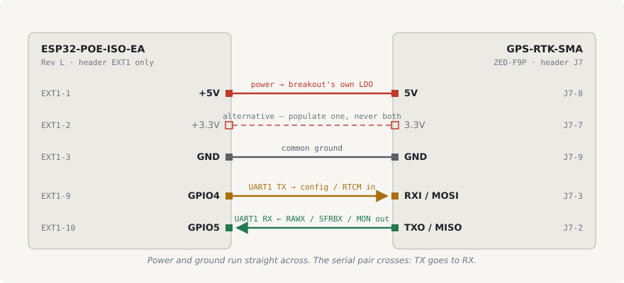

# gnss-bridge -- the attic ZED-F9P's link to the network

An Olimex **ESP32-POE-ISO-EA (Rev L)** that moves bytes between the receiver's UART1 and one
TCP client. It holds no GNSS logic: RTCM generation, the base coordinate and the caster all
live in [`tanka/environments/ntrip/`](../../tanka/environments/ntrip/README.md), where
`str2str` builds the RTCM MSM messages from the receiver's raw observations.

```
ZED-F9P --UART1 460800--> ESP32-POE-ISO --TCP 6638--> str2str_tcp --> 127.0.0.1:5015
  (SparkFun GPS-RTK-SMA)      (PoE, attic)             (any worker)      |
                                                                         +--> NTRIP caster :2101
```

The receiver is on a UART rather than its USB port because the ESP32 has no USB host. Its USB
port keeps its own independent `CFG-MSGOUT` configuration, untouched, so a USB cable into any
machine is a working fallback.

**Status: nothing here has been built.** The ESP32 board is on hand; headers, crimp contacts
and the optional sensor are not ordered. Pin assignments below are read off the two vendors'
schematics, not off a working unit. This is a reference for whenever the parts show up, not a
queued task -- the rest of PR #813 is inert until the prod tag moves anyway.

## Wiring



| Wire | ESP32-POE-ISO | Pin | GPS-RTK-SMA | Pin |
|---|---|---|---|---|
| red | `+5V` | EXT1-1 | `5V` | J7-8 |
| black | `GND` | EXT1-3 | `GND` | J7-9 |
| yellow | `GPIO4` (UART1 TX) | EXT1-9 | `RXI/MOSI` | J7-3 |
| green | `GPIO5` (UART1 RX) | EXT1-10 | `TXO/MISO` | J7-2 |

All four land on **EXT1**. The ESP32 routes UART through its GPIO matrix, so the pin choice is
config ([`gnss-bridge.yaml`](gnss-bridge.yaml)), not a constraint: GPIO32/33 (EXT2 pins 6 and
5) are the fallback if these two misbehave with Ethernet up.

The breakout's `DSEL` jumper selects SPI when closed, which disables UART1. It ships open.

### Why EXT1 and not UEXT

GPIO4 and GPIO5 are on both EXT1 (pins 9, 10) and UEXT (pins 3, 10), and UEXT also carries
`GPIO13`/`GPIO16` for the sensor -- but it brings out only +3.3V, and the 5V route is the
better supply ([Power](#power)). UEXT's IDC would also save no work here: J7 at the other end
is a 1x9 single row, so that end is discrete contacts either way.

One UEXT fact worth recording in case it is ever revisited: pin 4 reaches `GPIO36` through
`D4`, a series 1N5819, making that line pull-up dependent rather than push-pull. Every other
UEXT pin is a direct connection.

### Antenna

The `-EA` carries a **WROOM-32UE**, which has no PCB antenna -- the U.FL is the only RF path.
Nothing here needs it: the config declares `ethernet:` and no `wifi:`, so the radio never
starts and an open RF port has no transmitter to reflect into. Fit the pigtail and bulkhead
anyway while the board is on the bench, so enabling BLE later is a config change rather than
an enclosure teardown.

### Pins to solder

Olimex ships the board without headers. All three are 0.1 in / 2.54 mm.

| Board | Header | Strip | Used |
|---|---|---|---|
| ESP32-POE-ISO | EXT1 | 1x10 | 1 (or 2), 3, 9, 10 |
| ESP32-POE-ISO | EXT2 | 1x10 | only for the optional sensor |
| GPS-RTK-SMA | J7 | 1x9 | 2, 3, 7 or 8, 9 |

A 1x10 housing covers the ESP32 end with positions 1, 3, 9 and 10 populated; a 1x9 covers the
breakout end.

### The optional sensor

Not required for the GNSS link. `GPIO13` is SDA and `GPIO16` is SCL, EXT2 pins 10 and 7, with
+3.3V and GND from EXT1 pins 2 and 3. Both I2C lines carry 2.2k pull-ups on the Olimex board.

On a lead away from the board, since the ESP32 and the PHY warm anything sitting next to them
-- the same confound that makes the current attic record a CPU-die proxy.

## Power

The breakout brings out **3.3V and 5V on adjacent pins** (J7-7, J7-8) and carries an AP2112
good for 600 mA from a 5V input. So the only question is which Olimex rail feeds it.

**Feed 5V (EXT1-1 -> J7-8).** The breakout's own LDO regulates it down, so the receiver sees a
linear supply -- what u-blox asks for, and what SparkFun means by wanting under 50 mV ripple on
a direct 3.3V feed "for precision locating". No added part, and more headroom than the
alternative.

Load is about **180 mA**: the ZED-F9P at 68-130 mA depending on acquisition, plus up to 48 mA
for the SPK6618H's LNA through the SMA bias tee. A BLE radio added later averages tens of mA,
well inside what is left; WiFi, which peaks near 250 mA, is the one that would need rechecking. Per the Rev L pinout sheet the +5V pin
sources up to **0.4 A (2 W)**, and that total covers anything drawn through +3.3V as well;
+3.3V has its own **0.3 A (1 W)** sub-limit.

| Supply route | Draw | Against its rating |
|---|---|---|
| **5V in** (EXT1-1 -> J7-8) | 180 mA, 0.9 W | 45% of 0.4 A; 45% of the 2 W total |
| 3.3V in (EXT1-2 -> J7-7) | 180 mA, 0.59 W | 60% of 0.3 A; 59% of the 1 W sub-limit |

Feeding 3.3V bypasses the AP2112 and runs the receiver off the Olimex's SY8089 buck -- less
total draw and less heat, but a switching rail into a receiver that wants a quiet one.
`UBX-MON-RF` (`noisePerMS`, `agcCnt`, CN0) measures whether that costs anything.

(The older ESP32-POE user manual gives 1 W rather than 2 W for the ISO variant. The Rev L
pinout sheet is ISO-specific and matches the `F0505S-2WR2` fitted on the board, so these
figures follow the sheet.)

Pin order differs between the two: EXT1 1-2-3 is +5V, +3.3V, GND; J7 7-8-9 is 3.3V, 5V, GND.

## Temperature

`ESP32-POE-ISO-EA` is the commercial grade part, **0-70 C**; `-IND` is -40/+85. The other
parts in the chain are wider or equal: the `F0505S-2WR2` is -40/+105 and holds full 2 W to
+85 C, the ZED-F9P is -40/+85, and the SPK6618H antenna is -45/+70.

**The attic's ambient range is not known.** acebase exposed only a CPU die sensor and a static
`acpitz` value, so the temperature series in
[`docs/bare-metal-nodes.md`](../../docs/bare-metal-nodes.md) is a proxy measured on a part with
its own heat. The SHT4x on this board is the first ambient measurement the space will have.
Nearest thing to evidence today: the antenna has the same +70 C ceiling and has been up there
since about May 2023.

## Cutover

1. Flash over USB on the bench. The ISO board tolerates USB and PoE together; the non-isolated
   `ESP32-POE` does not. Thereafter it is OTA.
2. Give it a DHCP reservation as `gnss-bridge.local.symmatree.com` -- the name
   [`settings.conf`](../../tanka/environments/ntrip/settings.conf) resolves as
   `[main] ext_tcp_source`.
3. Record the receiver's current configuration over USB, while it still works:
   `./receiver-config.py export --serial /dev/ttyACM0 > receiver-config.txt`. This is the
   read-back path [tiles#704](https://github.com/symmatree/tiles/issues/704) asks for; commit
   the result so drift is a diff.
4. Wire per the table, then `./receiver-config.py apply --serial /dev/ttyACM0` to set the
   UART1 baud rate and message set in RAM and Flash. Flash, not BBR: the breakout has no
   battery backup, so a PoE drop would otherwise lose it.
5. Move the prod tag. `str2str_tcp` dials the bridge; `MON-COMMS` `txPeakUsage` and
   `overrunErrs` say whether the UART has headroom.

`MON-COMMS` and `MON-RF` are the diagnostics this receiver has. `MON-SYS` -- CPU load, memory,
die temperature -- is not available: the ZED-F9P Interface Description (UBX protocol 27.10)
never mentions it, and it first appears in the F9 HPS line at protocol 33.40. This firmware is
HPG 1.32, protocol 27.31.

Reverting is the same list backwards, and step 3's export is what makes that possible.

## When the link is down, corrections stop

Nothing buffers, and nothing should: RTCM is only useful time-aligned with the rover's own
observations, so a correction held for later is worthless by the time it is delivered. The
bridge discards UART bytes while no client is connected, which is the correct behaviour rather
than a limitation.

What a restart costs is therefore availability, not a record. While the pod is down -- a config
change, an image update, an eviction -- the caster is not serving, and a rover ages out of RTK
Fixed through Float to an uncorrected 3D fix. How the vehicle responds to that is a flight
stack question, not one this repo answers.

Two consequences worth keeping in view:

- **Land config changes between flights.** `strategy: Recreate` means a full stop and start.
- **One persistent client on the bridge.** The stream server fans one UART through a single
  shared ring buffer and drops a slow client's pending bytes, so a second long-lived reader is
  a way to lose receiver data. Anything else that wants the stream connects to rtkbase's
  `127.0.0.1:5015` relay, which is what the relay is for -- and which runs `str2str -b 1`, so
  writes there reach the receiver's UART through the bridge.
